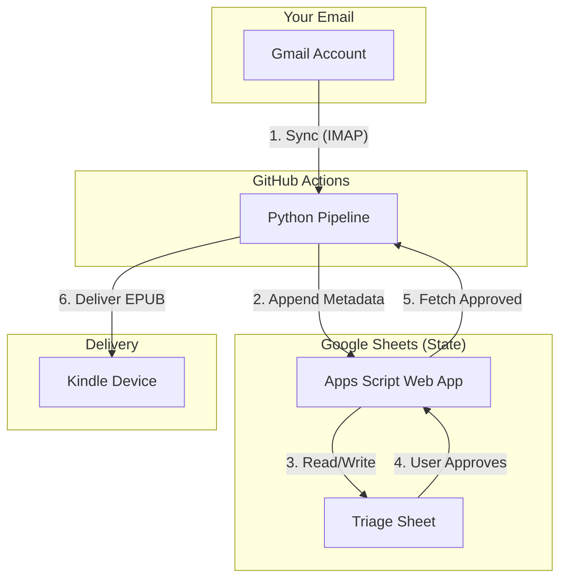
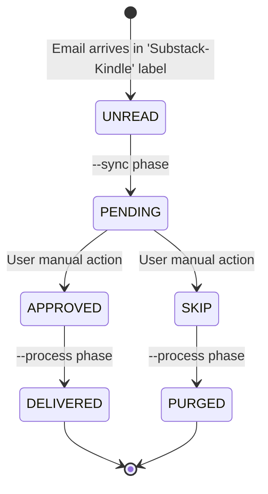

# Substack RFK: Substack-to-Kindle Curation Pipeline

A Python-based CLI tool designed to curate paid newsletters (e.g., Substack) and deliver them as sanitized, offline-ready EPUB files to a Kindle device. It uses a Google Sheet as a stateful Triage Gateway.

## Architecture & Data Flow

The application connects your newsletter inbox to your Kindle via a Google Sheet state manager.

### Component Diagram


### State Lifecycle


## Setup Checklist (Public Adoption)

Follow these steps to set up your own instance of the Substack RFK:

1.  **Google Sheet Template:**
    *   Create your own copy of the [Google Sheet Template](https://docs.google.com/spreadsheets/d/1kJaFn914UtyzH0sDeVDlxFKmetmpXgec1vLhaKVpp84/copy).
    *   Use the `Substack RFK` menu to **Generate API Secret**.
    *   Deploy as a **Web App** (Execute as: Me, Access: Anyone).
    *   **Save the Web App URL and your Secret.**

2.  **Gmail Account:**
    *   Enable **2-Step Verification**.
    *   Generate a single **App Password** for Mail.
    *   Create the labels `Substack-Kindle` and `Substack-Kindle-Processed`.
    *   Set up a filter to apply the `Substack-Kindle` label to incoming newsletters.

3.  **Fork this Repository:**
    *   Click "Fork" on GitHub, or use the GitHub CLI:
        ```bash
        gh repo fork arsenyspb/substack-reader-for-kindle --clone
        ```
    *   Go to `Settings` -> `Secrets and variables` -> `Actions`.
    *   Add the following secrets:
        *   `GMAIL_USER`
        *   `GMAIL_APP_PASSWORD`
        *   `KINDLE_EMAIL`
        *   `WEB_APP_URL`
        *   `WEB_APP_SECRET`
        *   `ALLOWLISTED_SENDERS` (Optional)

## Operations

The pipeline runs automatically every 30 minutes via GitHub Actions.

- **Phase 1: Sync (`--sync`)** - Ingests new emails from the `Substack-Kindle` label into the sheet.
- **Phase 2: Process (`--process`)** - Checks the sheet for `APPROVED` or `SKIP` statuses and fulfills them.

## 🤝 Contribution & Feedback
All bug reports, feature requests, and technical inquiries should be submitted as **GitHub Issues**.

## File Structure

- `src/main.py`: CLI orchestrator.
- `templates/Code.gs`: The Apps Script code for your Google Sheet.
- `src/sheet_manager.py`: Communicates with the Google Sheet Web App.
- `src/media_engine.py`: HTML parsing and image optimization.
- `src/epub_builder.py`: EPUB compilation.
- `src/mail_client.py`: IMAP/SMTP operations.
- `.github/workflows/pipeline.yml`: GitHub Actions schedule.
