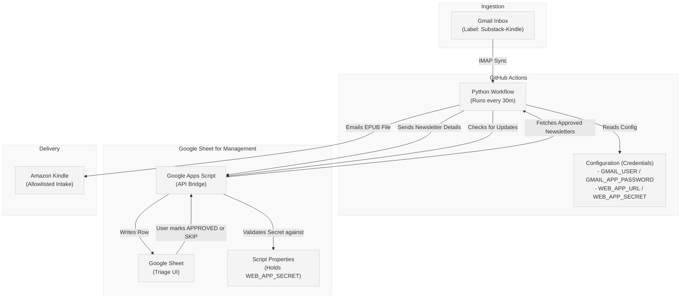
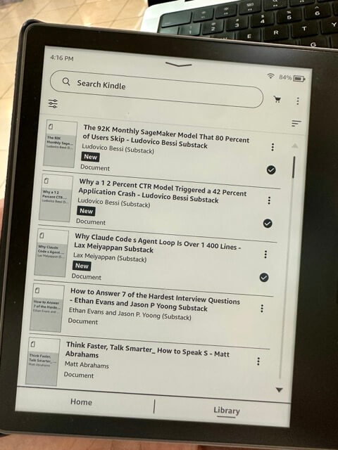
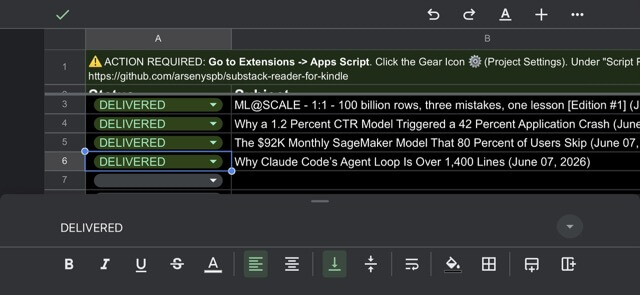

# Substack RFK: Substack-to-Kindle Pipeline

I built this pipeline because I wanted a frictionless way to read my favorite newsletters offline on my Kindle Oasis. I've designed it to be fully self-hosted via GitHub Actions so you can own your data and read offline without friction.

Deliver your favorite newsletters (Substack, etc.) as clean, beautiful EPUBs directly to your Kindle. This pipeline uses a Google Sheet as a triage gateway, allowing you to approve or skip content before it reaches your device.

**Built to be Forked:** This repository is a personal automation template. You are encouraged to fork it, add your own credentials, and run your own private instance on GitHub Actions.



## How it Works
1.  **Ingestion:** A GitHub Action checks your Gmail for emails tagged with the `Substack-Kindle` label (scanning the last 14 days).
2.  **Triage:** Metadata (Subject, Author, Date) is sent to your Google Sheet with a `PENDING` status.
3.  **Approval:** You manually mark rows as `APPROVED` or `SKIP` in the sheet.
4.  **Delivery:** The next pipeline run fetches approved items, converts them to EPUB, emails them to your Kindle, and updates their status.

### Status Lifecycle
Every newsletter row in the Google Sheet progresses through specific statuses:
*   `PENDING`: A newly ingested newsletter waiting for your review.
*   `APPROVED`: You've marked this row to be sent to your Kindle.
*   `SKIP`: You've chosen to ignore/skip this newsletter.
*   `DELIVERED`: The pipeline successfully sent the newsletter EPUB to your Kindle.
*   `PURGED`: The newsletter was ignored and cleaned up (triggered by `SKIP`).
*   `ERROR`: Something went wrong during fetching, conversion, or delivery (such as "ERROR: No Content").

---

## Setup
Ready to get started? Follow our detailed step-by-step guide:

**[View the Detailed Setup Guide (docs/SETUP.md)](docs/SETUP.md)**

---

## Security & Privacy
Substack-RFK is designed with a "security-first" mindset for personal automation:

*   **Scoped Access:** By using **App Passwords** and a specific **Gmail Label** (`Substack-Kindle`), the pipeline only interacts with newsletters you've explicitly tagged. It never reads your personal correspondence.
*   **Burner Account Support:** For maximum isolation, you can use a dedicated "burner" Gmail account and simply forward your newsletters to it.
*   **Encrypted Logs:** Sensitive metadata (like newsletter subjects) is XOR-obfuscated in GitHub Action logs, ensuring your reading habits remain private even in public repositories.
*   **Extensibility:** We welcome PRs to add support for other email providers (Outlook, Fastmail, etc.)! Check `src/mail_client.py` to see how to contribute.

## Usage
*   The pipeline runs automatically every 30 minutes and scans for any emails from the last 14 days in your `Substack-Kindle` label.
*   You can trigger it manually from the **Actions** tab in GitHub.
*   Check your Google Sheet daily to approve new newsletters!

### Updating
If you pull new code from this repository and encounter a **Version Mismatch** error:
1.  Go to your Google Sheet -> `Extensions -> Apps Script`.
2.  Copy the latest code from `templates/Code.gs` in this repo and paste it into the editor.
3.  **Click Save.**
4.  **CRITICAL:** You must re-deploy for the changes to take effect. Click **Deploy -> New Deployment**. 
5.  Select the same settings as before (Me / Anyone) and click **Deploy**.
6.  Update your `WEB_APP_URL` in GitHub if the URL changed (it usually does for a "New Deployment").

## Testing
Run the unit tests to ensure the pipeline is working correctly:
```bash
pip install -r requirements.txt
python3 -m pytest
```

## Contributing
Found a bug or have a feature request? Please [open a GitHub Issue](https://github.com/arsenyspb/substack-reader-for-kindle/issues).

## Screenshots




## License
MIT
